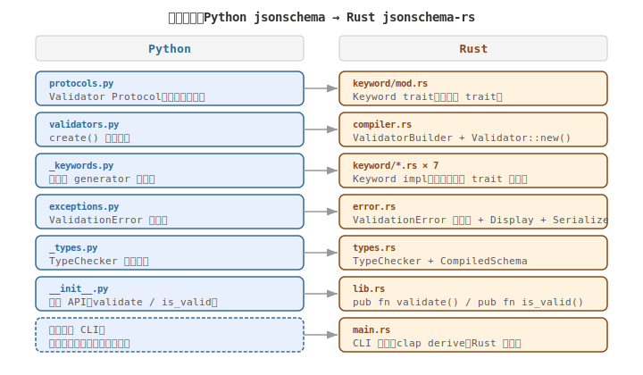
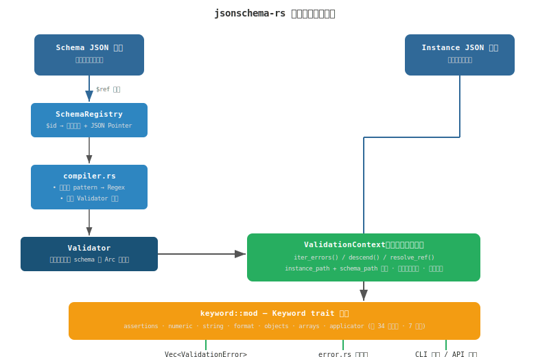

# jsonschema-rs

A fast JSON Schema validator written in Rust — a high-performance rewrite of the Python [`jsonschema`](https://github.com/python-jsonschema/jsonschema) library.

Supports **JSON Schema Draft 2020-12** with **34 keywords** and **83.5% official test suite compliance** (1,741 / 2,086 tests passing, core keywords > 92%).

---

## Project Structure

```
jsonschema-rs/
├── Cargo.toml                  # 项目清单：依赖、二进制目标、release 优化配置
├── Cargo.lock                  # 依赖版本锁定
├── README.md                   # 本文件
├── .gitignore
│
├── src/                        # 源代码
│   ├── lib.rs                  # 库入口：模块声明 + 公共 API re-export
│   ├── main.rs                 # CLI 入口（clap derive），子命令 validate
│   ├── types.rs                # 类型系统：CompiledSchema、Instance 别名、TypeChecker
│   ├── compiler.rs             # Schema 编译：Validator 构造 + pattern 正则预编译
│   ├── validator.rs            # 核心引擎：ValidationContext 递归验证 + $ref 四级回退解析
│   ├── refs.rs                 # 引用解析：SchemaRegistry、JSON Pointer、$anchor、$id 查找
│   ├── error.rs                # 错误类型：ValidationError 结构体 + Display + Serialize
│   ├── instance.rs             # 实例遍历辅助：deep_equal、known_property_keys
│   │
│   ├── keyword/                # 关键字验证器（每个关键字实现 Keyword trait）
│   │   ├── mod.rs              # Keyword trait 定义 + KeywordRegistry + 辅助函数
│   │   ├── assertions.rs       # type, enum, const
│   │   ├── numeric.rs          # minimum, maximum, exclusiveMin/Max, multipleOf
│   │   ├── string.rs           # minLength, maxLength, pattern
│   │   ├── format.rs           # format（20+ 种格式：date/time/email/hostname/ipv4/ipv6/uri/uuid…）
│   │   ├── objects.rs          # properties, required, additionalProperties,
│   │   │                       #   patternProperties, propertyNames, min/maxProperties,
│   │   │                       #   dependentRequired, dependentSchemas, dependencies
│   │   ├── arrays.rs           # items, prefixItems, min/maxItems, uniqueItems,
│   │   │                       #   contains, minContains, maxContains
│   │   └── applicator.rs       # allOf, anyOf, oneOf, not, if/then/else
│   │
│   └── bin/
│       └── perf_test.rs        # 独立性能基准测试二进制
│
├── tests/                      # 测试
│   ├── integration.rs          # 自定义集成测试（8 个场景）
│   ├── runner.rs               # 官方 JSON Schema Test Suite runner
│   └── test_suite/             # 官方测试套件（git submodule）
│       └── tests/draft2020-12/ # Draft 2020-12 测试用例（47 必选 + 21 可选格式）
│
└── report/                     # 实验报告
```

### Architecture Overview

**架构映射**（Python `jsonschema` → Rust trait 系统）：



**数据流**（Schema 编译 → 递归验证 → 错误输出）：



---

## Supported Keywords (34 total)

| Category | Keywords |
|----------|----------|
| **Assertions** | `type`, `enum`, `const` |
| **Numeric** | `minimum`, `maximum`, `exclusiveMinimum`, `exclusiveMaximum`, `multipleOf` |
| **String** | `minLength`, `maxLength`, `pattern` |
| **Format** | `format` — supports 20+ formats: `date`, `time`, `date-time`, `email`, `idn-email`, `hostname`, `idn-hostname`, `ipv4`, `ipv6`, `uri`, `uri-reference`, `uri-template`, `iri`, `iri-reference`, `uuid`, `json-pointer`, `relative-json-pointer`, `regex`, `ecmascript-regex`, `duration` |
| **Objects** | `properties`, `required`, `additionalProperties`, `patternProperties`, `propertyNames`, `minProperties`, `maxProperties`, `dependentRequired`, `dependentSchemas`, `dependencies` |
| **Arrays** | `items`, `prefixItems`, `minItems`, `maxItems`, `uniqueItems`, `contains`, `minContains`, `maxContains` |
| **Applicators** | `allOf`, `anyOf`, `oneOf`, `not`, `if` / `then` / `else` |
| **References** | `$ref` (internal + external via `SchemaRegistry`), `$anchor`, `$defs` |

---

## Why Rust?

| Metric | Python `jsonschema` | `jsonschema-rs` (Rust) |
|--------|---------------------|------------------------|
| Speed | Interpreted (baseline) | **64–2,172× faster** (compiled) |
| Memory | GC overhead | **3–10× less** RAM |
| Concurrency | GIL-bound | **Rayon parallel** batch validation |
| Safety | Runtime errors | **Compile-time** memory + thread safety |
| Regex | Re-compiled on each `re.match()` | **Pre-compiled** at schema construction |

---

## Quick Start

### Prerequisites

- [Rust](https://rustup.rs/) 1.70+

### Install

```bash
# Install globally (adds jsonschema-rs to PATH)
cargo install --path .

# Or build without installing
cargo build --release --bin jsonschema-rs
# binary at: ./target/release/jsonschema-rs (or .exe on Windows)
```

---

## CLI Usage

### Command Format

```
jsonschema-rs validate --schema <SCHEMA_PATH> --data <DATA_PATH> [--output <FORMAT>]
```

### Options

| Option | Short | Required | Description |
|--------|-------|----------|-------------|
| `--schema` | `-s` | Yes | Path to JSON Schema file |
| `--data` | `-d` | Yes | Path to JSON data file to validate |
| `--output` | — | No | Output format: `text` (default) or `json` |
| `--help` | `-h` | — | Show help |
| `--version` | `-V` | — | Show version |

### Exit Codes

| Code | Meaning |
|------|---------|
| `0` | Validation passed — the data conforms to the schema |
| `1` | Validation failed — errors found, or file read/parse error |

### Examples

**Step 1: Create a schema file** (`schema.json`):

```json
{
  "type": "object",
  "properties": {
    "name": { "type": "string", "minLength": 1 },
    "age":  { "type": "integer", "minimum": 0, "maximum": 150 }
  },
  "required": ["name"]
}
```

**Step 2: Create data files**:

`alice.json` (valid):
```json
{ "name": "Alice", "age": 30 }
```

`bad.json` (invalid — empty name, negative age):
```json
{ "name": "", "age": -1 }
```

**Step 3: Validate**:

```bash
# --- Valid data: no errors ---
$ jsonschema-rs validate -s schema.json -d alice.json
✓ Valid

# --- Invalid data: text output (default) ---
$ jsonschema-rs validate -s schema.json -d bad.json
✗ Invalid — 2 error(s):
  1. /name: '' is shorter than minimum length of 1
  2. /age: -1 is less than the minimum of 0

# --- Invalid data: JSON output (for CI/CD pipelines) ---
$ jsonschema-rs validate -s schema.json -d bad.json --output json
[
  {
    "message": "-1 is less than the minimum of 0",
    "keyword": "minimum",
    "instance_path": ["age"],
    "schema_path": ["properties", "age", "minimum"],
    "instance": -1
  },
  {
    "message": "'' is shorter than minimum length of 1",
    "keyword": "minLength",
    "instance_path": ["name"],
    "schema_path": ["properties", "name", "minLength"],
    "instance": ""
  }
]
```

### Windows Note

If `jsonschema-rs` is not in PATH after `cargo install`, use `cargo run` directly:

```powershell
cargo run --bin jsonschema-rs -- validate -s schema.json -d data.json
```

The `--` separates Cargo's arguments from the program's arguments.

---

## Library API

### Basic Validation

```rust
use jsonschema_rs::Validator;

let validator = Validator::new(serde_json::json!({
    "type": "object",
    "properties": {
        "name": { "type": "string", "minLength": 1 },
        "age":  { "type": "integer", "minimum": 0 }
    },
    "required": ["name"]
}));

// 1. Returns `Result<(), ValidationError>` — fails on first error
validator.validate(&data)?;

// 2. Returns `bool` — fastest path, no error details
assert!(validator.is_valid(&valid_data));
assert!(!validator.is_valid(&invalid_data));

// 3. Returns all errors — for detailed error reporting
let all_errors: Vec<ValidationError> = validator.iter_errors(&data);
for err in &all_errors {
    eprintln!("{} | keyword={} | path={}",
        err.message,
        err.keyword.as_deref().unwrap_or("-"),
        err.instance_path.join("/")
    );
}
```

### External `$ref` Resolution

```rust
use jsonschema_rs::{Validator, SchemaRegistry};

let mut registry = SchemaRegistry::default();
registry.add("http://example.com/geo.json", serde_json::json!({
    "$defs": { "Point": { "type": "object" } }
}));

let schema = serde_json::json!({
    "$ref": "http://example.com/geo.json#/$defs/Point"
});

let validator = Validator::new(schema).with_registry(registry);
assert!(validator.is_valid(&serde_json::json!({"x": 1, "y": 2})));
```

### Schema Introspection

```rust
let validator = Validator::new(schema);
let raw: &Value = validator.schema();  // access the original schema JSON
```

---

## Performance

### Quick Benchmark

```bash
# Rust performance test
cargo run --release --bin perf_test

# Python comparison (requires jsonschema and fastjsonschema)
pip install jsonschema fastjsonschema
python -c "
import timeit
from jsonschema import validate
schema = {'type': 'string'}
data = 'hello world'
for _ in range(100): validate(data, schema)
t = timeit.Timer(lambda: validate(data, schema))
print(f'jsonschema simple_type: {50000/t.timeit(number=50000):.0f} ops/sec')
"
```

### Results (vs Python `jsonschema`, interpreted)

| Scenario | Rust ops/sec | Python ops/sec | Speedup |
|----------|-------------|----------------|---------|
| Simple type check | 13,519,460 | 6,226 | **2,172×** |
| Object with 3 properties | 1,360,352 | 1,579 | **862×** |
| Large object (100 fields) | 51,444 | 73 | **705×** |
| Nested array (20 items) | 87,089 | 1,364 | **64×** |

vs Python `fastjsonschema` (code-generation): comparable performance (0.7–1.2×), with more keyword support in Rust.

*Environment: Windows 11, i7-13700H, Rust 1.88.0 (release + LTO), Python 3.13*

---

## Testing

```bash
# Unit tests (77) + integration tests (8)
cargo test --lib --test integration

# Official JSON Schema Test Suite (2,086 tests)
# First, clone the suite:
git clone https://github.com/json-schema-org/JSON-Schema-Test-Suite.git tests/test_suite
# Then run:
cargo test --test runner -- --nocapture
```

---

## Dependencies

| Crate | Version | Purpose |
|-------|---------|---------|
| `serde` + `serde_json` | 1 | JSON parsing / serialization |
| `clap` | 4 (derive) | CLI argument parsing |
| `regex` | 1 | Pattern keyword pre-compilation |
| `rayon` | 1 | Parallel batch validation |
| `thiserror` | 2 | Error type derive macros |

**Release profile**: LTO enabled, `codegen-units = 1` for maximum optimization.

---

## License

MIT
